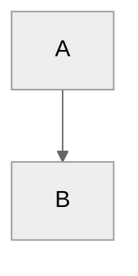
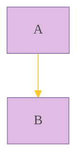
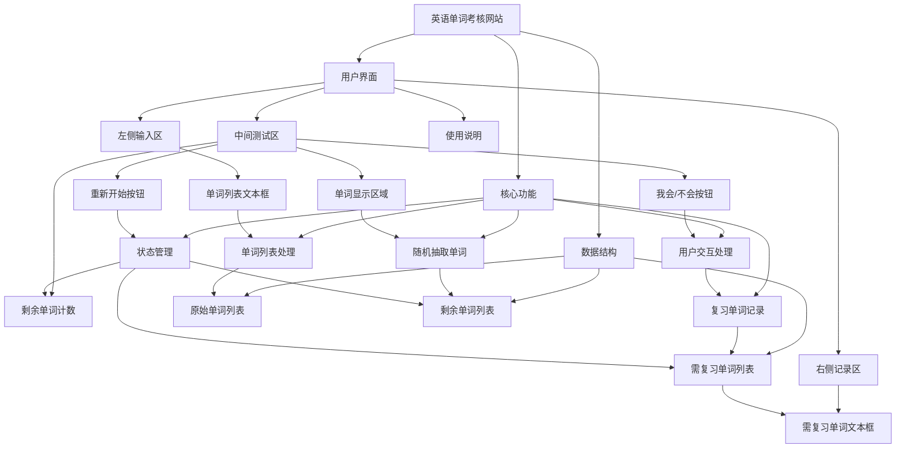

# 介绍

## 语言介绍

## 语法结构

### 一般语法结构

行注释：可以忽略“%% ”之后行中的任何内容

### `%%{init:{}}%%` 指令（Directives）

指令允许在图表渲染之前对其进行重新配置。它可以改变图表的字体样式、颜色和其他美学方面

目前唯一可用的指令是 init

#### `'theme'`

通常用于在图表开始时配置 Mermaid 渲染器的一些全局或特定图表的行为和样式

- 指令中的内容是 JSON 格式，由键值对组成
- `'theme':'value'`，其中，value = `default`（默认）、`forest`（森林）、`dark`（暗色）、`neutral`（中性）和 `base`（基础，用于自定义主题）
- 代码示例：（中性比较好看:star:)

#### `'themeVariables'`

允许对当前主题的具体颜色、字体、线条粗细等进行细粒度定制。可以覆盖主题中定义的任何 CSS 变量

- 主题需要使用 `'base'`
- 代码示例：

## Mermaid所有图表名称

1.  ➡️ **流程图** (Flowchart)
2.  💬 **时序图** (Sequence Diagram)
3.  🌸 **类图** (Class Diagram)
4.  🔄 **状态图** (State Diagram)
5.  💞 **实体关系图** (Entity Relationship Diagram)：一种流程图，用于展示系统中“实体”（如人、物或概念）之间如何相互关联。常用于在软件工程、商业信息系统、教育和研究领域设计或调试关系型数据库
6.  🚶‍♀️ **用户旅程图** (User Journey)
7.  ⏳ **甘特图** (Gantt)
8.  🍰 **饼图** (Pie Chart)
9.  🎯 **象限图** (Quadrant Chart)
10. ✅ **需求图** (Requirement Diagram)
11. 🌲 **GitGraph (Git) 图** (GitGraph (Git) Diagram)：用于描绘Git提交和Git操作（命令）在不同分支上的情况
12. 🏗️ **C4 图** (C4 Diagram)：用于对软件系统架构进行建模；它基于将系统分解为容器和组件的层次结构（上下文、容器、组件和代码），并依赖于现有建模技术（如统一建模语言UML或实体关系图ERD）来对架构构建块进行更详细的分解
13. 💡 **思维导图** (Mindmaps)
14. 🗓️ **时间线图** (Timeline)
15. 🌈 **ZenUML**
16. 🌊 **桑基图** (Sankey)：一种数据可视化技术或流程图，强调从一种状态到另一种状态或从一个时间到另一个时间的流/运动/变化
17. 📈 **XY 图** (XY Chart)
18. 🧱 **块图** (Block Diagram)
19. 📦 **数据包图** (Packet)
20. 📋 **看板图** (Kanban)
21. 🏢 **架构图** (Architecture)
22. 🕸️ **雷达图** (Radar)

## Mermaid与AI交互

### 作为输出

- 可以告诉AI对应的图表名称（见上），让ta画

### 作为输出

- 写代码时可以输入mermaid（**当然可以是别的AI输出的**）来告知AI整个项目的架构、布局或流程顺序
- 示例如下：一段有关网页设计的mermaid（由ds-r1输出）

