# 介绍

时间：`2025年10月28日`

## 1. Mermaid 介绍

> Mermaid 是一个基于 JavaScript 的图表绘制工具，它使用 Markdown 启发的文本定义和渲染器来创建和修改复杂的图表。Mermaid 的主要目的是帮助文档跟上开发的步伐。
>
> **图表和文档会耗费开发者宝贵的时间，并且很快就会过时**。但是，没有图表或文档会破坏生产力并损害组织学习。
> 
> Mermaid 通过使用户能够创建易于修改的图表来解决这个问题，它也可以成为生产脚本（和其他代码片段）的一部分。

---

## 2. Mermaid 所有图表名称

1.  ➡️ **流程图** (Flowchart)
2.  💬 **时序图** (Sequence Diagram)
3.  🌸 **类图** (Class Diagram)
4.  🔄 **状态图** (State Diagram)
5.  💞 **实体关系图** (Entity Relationship Diagram)：一种流程图，用于展示系统中“实体”（如人、物或概念）之间如何相互关联。常用于在软件工程、商业信息系统、教育和研究领域设计或调试关系型数据库
6.  🚶‍♀️ **用户旅程图** (User Journey)
7.  ⏳ **甘特图** (Gantt)
8.  🍰 **饼图** (Pie Chart)
9.  🎯 **象限图** (Quadrant Chart)
10. ✅ **需求图** (Requirement Diagram)
11. 🌲 **GitGraph (Git) 图** (GitGraph (Git) Diagram)：用于描绘Git提交和Git操作（命令）在不同分支上的情况
12. 🏗️ **C4 图** (C4 Diagram)：用于对软件系统架构进行建模；它基于将系统分解为容器和组件的层次结构（上下文、容器、组件和代码），并依赖于现有建模技术（如统一建模语言UML或实体关系图ERD）来对架构构建块进行更详细的分解
13. 💡 **思维导图** (Mindmaps)
14. 🗓️ **时间线图** (Timeline)
15. 🌈 **ZenUML**
16. 🌊 **桑基图** (Sankey)：一种数据可视化技术或流程图，强调从一种状态到另一种状态或从一个时间到另一个时间的流/运动/变化
17. 📈 **XY 图** (XY Chart)
18. 🧱 **块图** (Block Diagram)
19. 📦 **数据包图** (Packet)
20. 📋 **看板图** (Kanban)
21. 🏢 **架构图** (Architecture)
22. 🕸️ **雷达图** (Radar)

---

## 3. 使用 Mermaid 与 LLM 交互

### 作为输出

- 可以告诉LLM对应的图表名称（见上），让ta画

### 作为输入

- 写代码时可以输入mermaid（**当然可以是别的AI输出的**）来告知AI整个项目的架构、布局或流程顺序
- 示例如下：一段有关网页设计的mermaid（由ds-r1输出）

```mermaid
graph TD
    A[英语单词考核网站] --> B[用户界面]
    A --> C[核心功能]
    A --> D[数据结构]
    
    B --> B1[左侧输入区]
    B --> B2[中间测试区]
    B --> B3[右侧记录区]
    B --> B4[使用说明]
    
    B1 --> B11[单词列表文本框]
    B2 --> B21[单词显示区域]
    B2 --> B22[我会/不会按钮]
    B2 --> B23[剩余单词计数]
    B2 --> B24[重新开始按钮]
    B3 --> B31[需复习单词文本框]
    
    C --> C1[单词列表处理]
    C --> C2[随机抽取单词]
    C --> C3[用户交互处理]
    C --> C4[复习单词记录]
    C --> C5[状态管理]
    
    D --> D1[原始单词列表]
    D --> D2[剩余单词列表]
    D --> D3[需复习单词列表]
    
    B11 --> C1
    C1 --> D1
    C2 --> D2
    B21 --> C2
    B22 --> C3
    C3 --> C4
    C4 --> D3
    C5 --> D2
    C5 --> D3
    D3 --> B31
    B24 --> C5
    C5 --> B23
```

