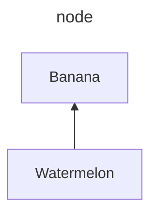
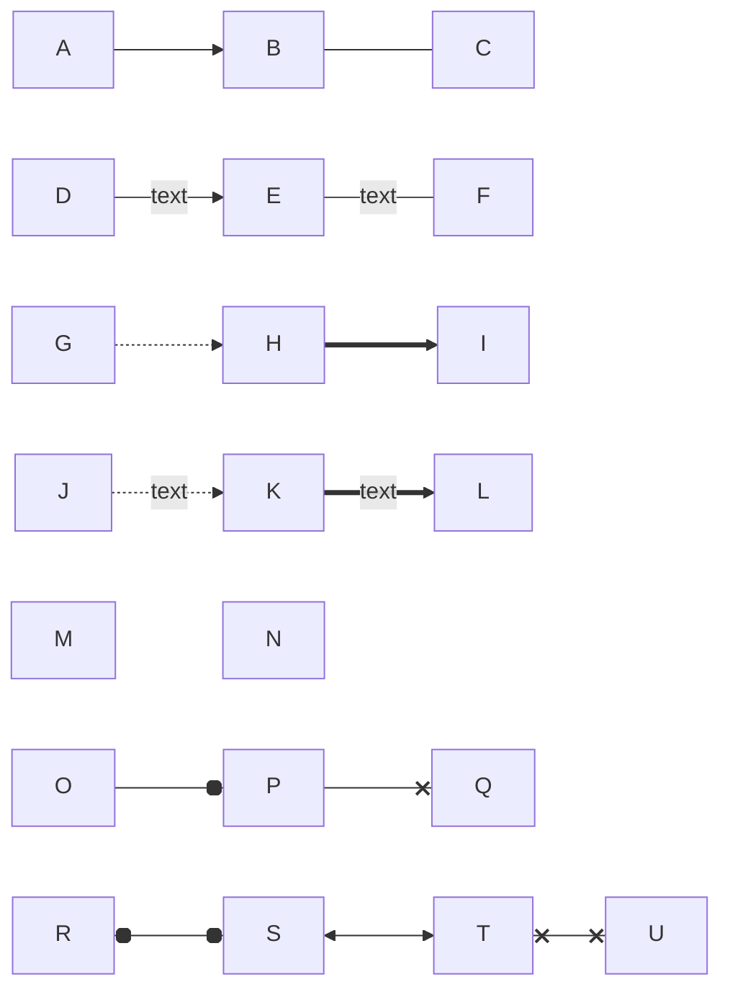
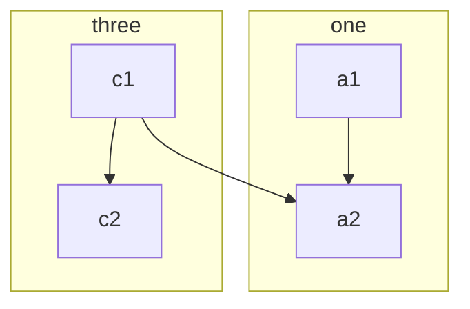
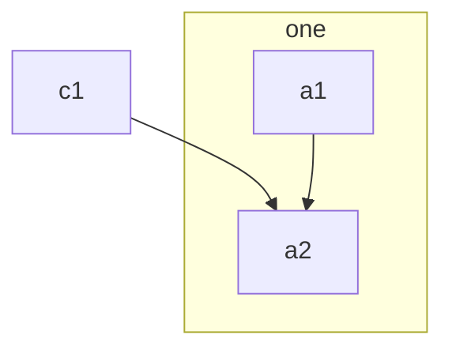

# 流程图 1：基本语法

时间：`2025年10月28日`

## 1. 基本介绍

- 流程图（flow chart），也称为graph，是各个领域中最常见和最通用的图表之一
- 流程图由边和节点组成。The Mermaid code defines how nodes and edges are made and accommodates different arrow types, multi-directional arrows, and any linking to and from subgraphs.
- `flowchart` 关键字或 `graph` 关键字用于表示流程图定义的开始

---

## 2. 开头

### Title

- 使用 `---` 包裹 `title`
- *官方文档说还可以包括 `theme` 和 `look`，但是vscode里面好像不能实现这两个功能*

    ```
    ---
    title: A
    %% 记得冒号后有空格
    ---
    ```

### 定义流程图方向

流程图的方向定义如下：

- `TD` - 从上到下
- `BT` - 从下到上
- `RL` - 从右到左
- `LR` - 从左到右
- 语法：`graph LR`

代码示例：



---

## 3. 节点（node）

### 形状

- 默认是矩形，除此之外的形状展示在下方代码中
- 只介绍常用的
- 注意：
  - 自定义形状的话需要写 node 的 id
  - id 与后面的符号之间不能有空格
  - id 类似于别的语言中的 id，是唯一的，不能给两个节点命名同一个 id
- **形状代码：**

    ```mermaid
    graph RL
        默认形状
        or[或者使用方括号]
        id1(圆角矩形);
        id2([“体育场形”]);
        C{菱形}
        4((圆形));
        a>旗帜]
        id3{{六边形}};
        id4[/平行四边形/]
        id5[/梯形\]
        id6[(数据库形)];

        默认形状 --- or
        id1 --- id2
        C --- 4
        a --- id3
        id4 --- id5
    ```

- **现在mermaid支持新的写法，以定义形状**：`id@{ shape: 形状, label: "内容" }`
  - 代码示例

      ```mermaid
      graph TD
          A[圆形]
          B[体育场形]
          C[菱形]

          A@{shape: circle}
          B@{shape: stadium}
          C@{shape: diamond}
      ```

### 内容

- 内部可以使用 markdown 语法或者 html 标签
  - 例如，换行就需要使用 \<br>
- 转义
  - *Special characters that break syntax*
  - 使用 `"text"` 双引号来确保内容一定被识别成文字，而不是特殊字符

---

## 4. 连线（edge）

### 连线类型

见下方代码示例：空格可带可不带



### 形成 Network

- 可以实现复杂的连线效果
- 要点：
  - 可以重复连、可以连自己
  - `-` 越多，连线越长
- 具体见下方代码示例：

    ```mermaid
    flowchart LR
    a --> b & c--> d
    A & B--> C & D------>E
    ```

- 另一复杂示例：

    ```mermaid
    flowchart TD
        A[Start] --> B{Is it?}
        B -- Yes --> C[OK]
        C --> D[Rethink]
        D --> B
        B -- No ----> E[End]
    ```

---

## 5. 子图（subgraphs）

### 基本语法

```
subgraph title
    graph definition 
        (contents)
end
<!-- 别忘记写 end -->
```

示例如下：





### 子图间连线

- 子图间也可以连线：写在最后
- 示例如下：

    ```mermaid
    flowchart TB
        c1-->a2
        subgraph one
            a1-->a2
        end

        subgraph two
            b1-->b2
        end

        subgraph three
            c1-->c2
        end

        one --> two
        three --> two
        two --> c2
    ```

- 也可以使用 id；示例如下：

    ```mermaid
    flowchart TB
        subgraph id1[one]
            a1-->a2
        end

        subgraph id2[two]
            b1-->b2
        end

        id1 --- id2
    ```

### 子图内方向

- 子图内可以定义与外面不同的方向：
  - 使用 `direction`
  - **换行 ＋ 缩进！**
- 示例如下：

    ```mermaid
    graph LR
    subgraph TOP
        direction TB

        subgraph B1
            direction RL
            i1 -->f1
        end

        subgraph B2
            direction BT
            i2 -->f2
        end
    end

    A --> TOP --> B
    B1 --> B2
    ```

---

## 6. 补充信息

### 一些语法建议

- 尽管有时候不写缩进也能正确显示，但是为了不折磨自己，还是多用缩进和空行
- 对于节点和边的数量很多的图：可以先写出所有的节点，再在最下面写出节点之间的关系
- 修饰写在最后
- 示例代码如下

    ```mermaid
    graph LR
        %% 所有node
        P(Root)
        P1(B1)
        P2(B2)
        P3(B3)

        P11(B11)
        P12(B12)

        P31(B31)
        P32(B32)
        P33(B33)

        %% 三个分支
        P --> P1
        P --> P2
        P --> P3

        %% 分支1路线
        P1 --> P11 --> P12

        %% 分支3路线
        P3 --> P31
        P3 --> P32 --> P33

        %% 分支间路线
        P31 --> P12
        P11 --> P33
    ```

### 网页链接

- 官网文档：https://mermaid.js.org/syntax/flowchart.html
- 中文网：https://mermaid.nodejs.cn/
- Github：https://github.com/mermaid-js/mermaid
