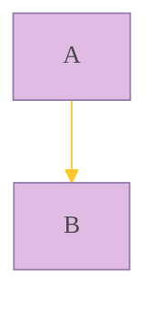

# 流程图 2：style

时间：`2025年10月29日`

## 1. `%%{init:{}}%%` 指令

- 指令（Directives）允许在图表渲染之前对其进行重新配置。它可以改变图表的字体样式、颜色和其他方面
- 目前唯一可用的指令是 `init`

### `'theme'`

- 通常用于在图表开始时配置 Mermaid 渲染器的一些全局或特定图表的行为和样式
- 指令中的内容是 **JSON 格式，由键值对组成**
  - `'theme':'value'`
  - 其中，value = `default`（默认）、`forest`（森林）、`dark`（暗色）、`neutral`（中性）和 `base`（基础，用于自定义主题）
- 代码示例：（中性比较好看)

    ```mermaid
    %%{
        init: {
            'theme':'neutral'  
        }
    }%%
    graph TD;
        A-->B;
    ```

### `'themeVariables'`

允许对当前主题的具体颜色、字体、线条粗细等进行细粒度定制。可以覆盖主题中定义的任何 CSS 变量

- 主题需要使用 `'base'`
- 代码示例：



---

## 2. Styling and Class

### 节点样式

- 语法格式：`style 节点id fill:#bbf,stroke:#f66,stroke-width:2px,color:#fff`
- 示例：

    ```mermaid
    graph LR
        id1(Start)-->id2(Stop)

        style id1 fill:#f9f001,stroke:#333,stroke-width:4px
        style id2 fill:#bbfb0,stroke:#f66,stroke-width:2px,color:#ff0
    ```

### 类

- 定义类：`classDef className fill:#f9f,stroke:#333,stroke-width:4px;`
- 将节点添加到类下：
  - `class nodeId1 className;`
  - 或者 `节点id:::类名`
- 示例

    ```mermaid
    graph LR
        n6(A) --- n7(B)

    n6:::Aqua
    n7:::Rose

    classDef Rose stroke-width:1px, stroke-dasharray:none, stroke:#FF5978, fill:#FFDFE5, color:#8E2236
    classDef Aqua stroke-width:1px, stroke-dasharray:none, stroke:#46EDC8, fill:#DEFFF8, color:#378E7A
    ```