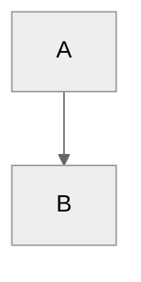
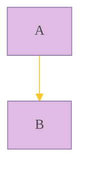

## `%%{init:{}}%%` 指令（Directives）

指令允许在图表渲染之前对其进行重新配置。它可以改变图表的字体样式、颜色和其他美学方面

目前唯一可用的指令是 init

### `'theme'`

通常用于在图表开始时配置 Mermaid 渲染器的一些全局或特定图表的行为和样式

- 指令中的内容是 JSON 格式，由键值对组成
- `'theme':'value'`，其中，value = `default`（默认）、`forest`（森林）、`dark`（暗色）、`neutral`（中性）和 `base`（基础，用于自定义主题）
- 代码示例：（中性比较好看:star:)

### `'themeVariables'`

允许对当前主题的具体颜色、字体、线条粗细等进行细粒度定制。可以覆盖主题中定义的任何 CSS 变量

- 主题需要使用 `'base'`
- 代码示例：

## Styling and classes

待补充，详见官网文档