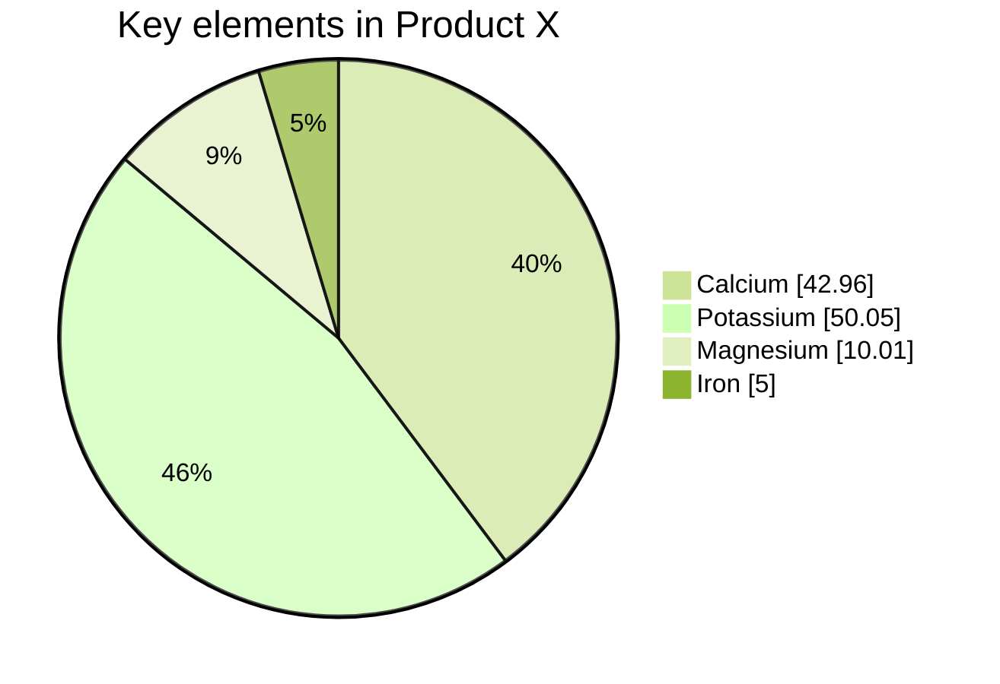

# 饼图

时间：`2025年10月28日`

## 1. 开头

**饼图（Pie chart）**，或称圆形图（circle chart）

- `theme` 同前
- 使用关键字 `pie` 绘制饼图
  - `pie` 之后可选的参数是 `showdata`，可以展示数据的数值
- `title`：后直接接标题名称

---

## 2. 数据

- 数据集：饼图的扇区将按照标签的相同顺序**顺时针排列**
- 语法格式：`"标签" : 数值`
  - 饼图中某个部分的标签，需放在双引号 `""` 内
  - 后跟冒号 `:` 作为分隔符
  - 后跟正数值（支持最多两位小数）
- 详见示例代码：

