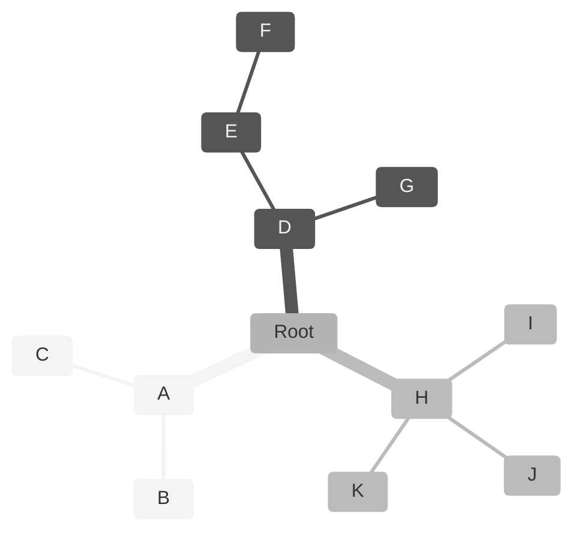
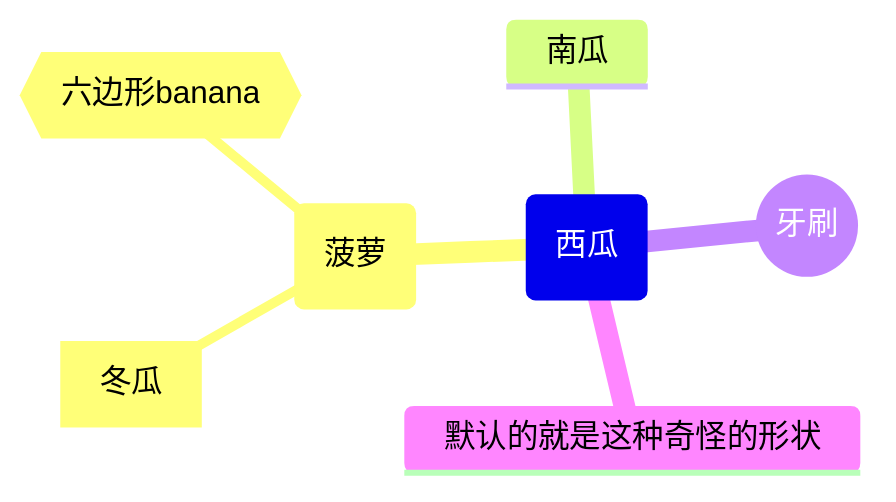
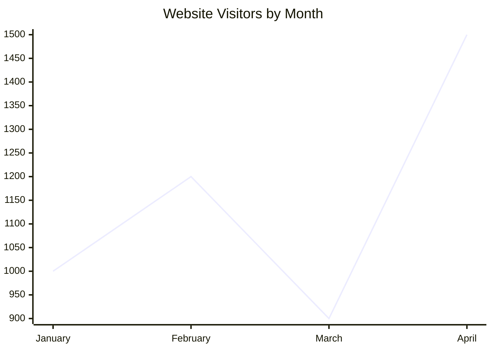
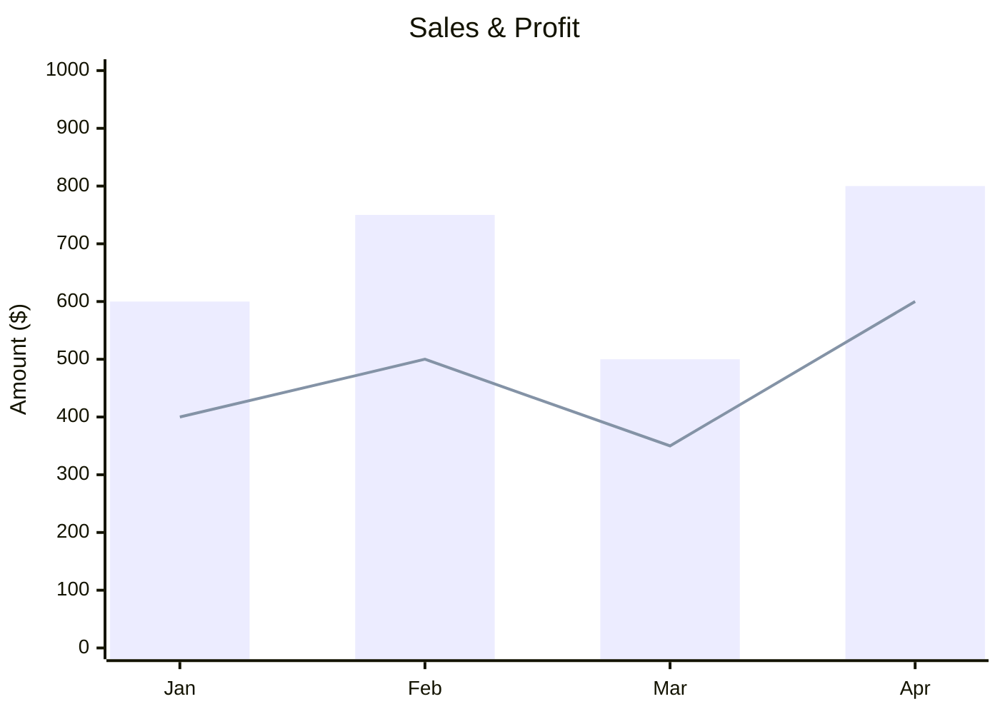
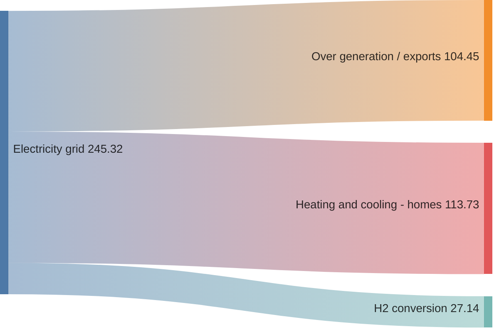

# 其他图表

时间：`2025年10月29日`

## 1. 思维导图

思维导图（Mindmap）：思维导图是一种用于将信息可视化地组织成层级结构的图表，它展示了整体各个部分之间的关系。它通常围绕一个单一的概念创建，这个概念以图像的形式绘制在空白页的中心，然后添加与该概念相关的想法的表示

### 基本语法

- 使用关键字 `mindmap` 来开始
- 思维导图的语法依赖于缩进来设置层级结构中的级别
  - 紧跟在 mindmap 声明之后的第一个非空行，且该行没有或只有最少缩进的节点，会被自动识别为根节点
  - 下面的字母可以直接替换为内容（见示例二）

### 个性化设置

**节点形状**

- 可以使用不同的形状来显示节点
- 为节点指定形状时，**语法与流程图节点类似**
- 例如，`id(I am a rounded square)`

**图标（icon）**：

- 此处略，详见官网文档：https://mermaid.js.org/syntax/mindmap.html

---

## 2. XY坐标图（xy chart）

使用 `xychart-beta` 关键字开始

标题：
- 语法： `title "图表标题"`
- 注意：
 - 如果标题只包含一个单词，可以不使用双引号，例如：`title Sales`
 - 如果标题包含空格或多个单词，必须使用双引号括起来，例如：`title "Sales Revenue"`

X 轴 (x-axis):X 轴主要用于表示分类数据，但也可以用作数值范围
- 作为分类轴：
 - 列出所有类别，用逗号分隔
 - 如果类别名称包含空格，请用双引号括起来。
 - 语法： `x-axis [cat1, "cat 2", cat3]`
- 作为数值范围轴:
 - 指定标题、最小值和最大值
 - 语法： `x-axis "坐标轴单位/标题" min_value --> max_value`

Y 轴 (y-axis)：只能用于表示数值范围，不能用于分类数据
- 指定标题和范围：
 - 语法： `y-axis "坐标轴单位/标题" min_value --> max_value`
- 如果不指定范围，范围就自动生成

代码示例：

数据系列 (line 和 bar)
- 折线图 (line)：语法： `line [value1, value2, value3, ...]`
- 条形图 (bar)：语法： `bar [value1, value2, value3, ...]`

代码示例：同时包含两个的

图表方向 (chartOrientation)
- 图表可以水平或垂直绘制。默认值为 vertical
- 语法： `chartOrientation: 'horizontal'` 或 `chartOrientation: 'vertical'`

**下面这些不重要，不看也行**

通用图表配置参数:这些参数直接应用于整个 XY 图表模块。

| 参数 | 描述 | 默认值 |
| :--- | :--- | :--- |
| `width`| 图表宽度 | `700` |
| `height` | 图表高度 | `500` |
| `titlePadding` | 标题的上下内边距 | `10` |
| `titleFontSize` | 标题字体大小 | `20` |
| `showTitle` | 是否显示标题 | `true` |
| `plotReservedSpacePercent` | 图表内绘图区域的最小空间百分比 | `50` |
| `showDataLabel` | 是否在条形图或折线图上显示对应值 | `false` |

轴配置 (xAxis 和 yAxis)：可以通过 xAxis 和 yAxis 参数进一步定制轴的外观。这些参数本身是一个 AxisConfig 对象

| 参数 | 描述 | 默认值 |
| :-------------- | :------------------------- | :----- |
| `showLabel` | 是否显示轴标签或刻度值 | `true` |
| `labelFontSize` | 绘制的标签字体大小 | `14` |
| `labelPadding` | 标签的上下内边距 | `5` |
| `showTitle` | 是否显示轴标题 | `true` |
| `titleFontSize` | 轴标题字体大小 | `16` |
| `titlePadding` | 轴标题的上下内边距 | `5` |
| `showTick` | 是否显示刻度 | `true` |
| `tickLength` | 刻度长度 | `5` |
| `tickWidth` | 刻度宽度 | `2` |
| `showAxisLine` | 是否显示轴线 | `true` |
| `axisLineWidth` | 轴线厚度 | `2` |

---

## 3. 桑基图

Sankey diagram

