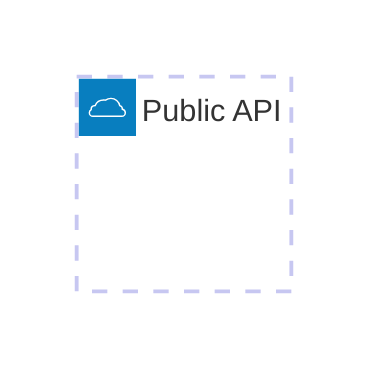
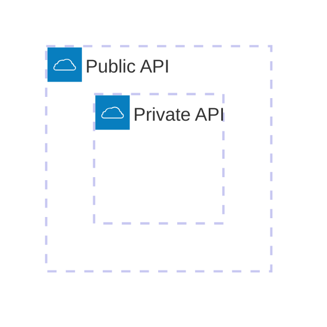
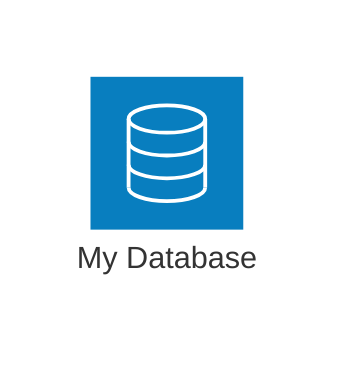
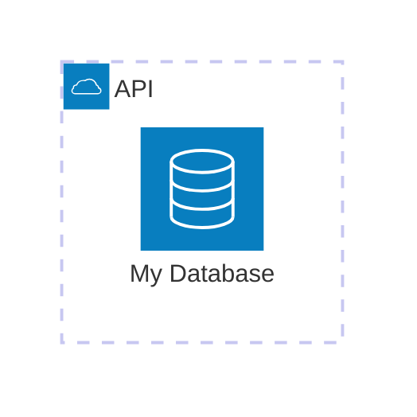
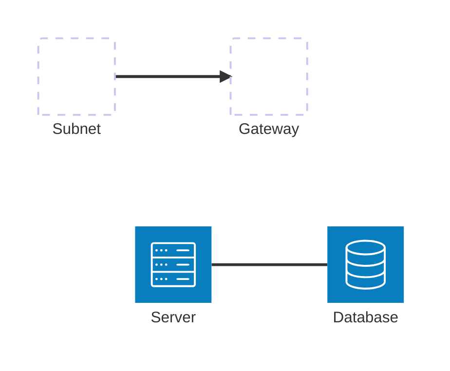
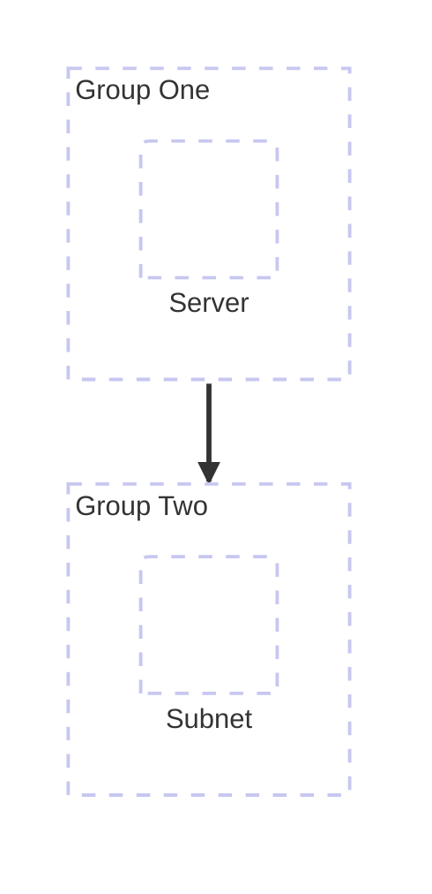
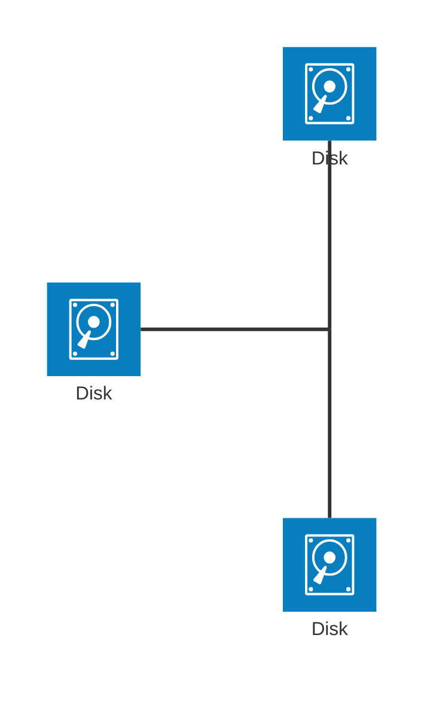

# Mermaid +1：架构图

架构图（Architecture Diagrams）

*这个有个问题，本地的加载不出在线图标，所以挺鸡肋的*

以关键字 `architecture-beta` 开头
- 架构图的构建块包括：
  - Groups (组)
  - Services (服务)
  - Edges (边)
  - Junctions (连接点)
- 图标和标签
  - 图标 (Icons)：通过将图标名称用 括号 () 括起来声明，例如 `(cloud)`
  - 标签 (Labels)：通过将文本用 方括号 [] 括起来声明，例如 `[API]`

### 组（group）

语法：`group {group id}({icon name})[{title}] (in {parent id})?`
- `{group id}`：组的唯一标识符
- `({icon name})`：可选，指定组的图标（例如 (cloud)）
- `[{title}]`：可选，组的显示名称（例如 [API]、[Public API]）
- `(in {parent id})?`：可选，表示该组嵌套在另一个组内。如果使用，{parent id} 必须是已声明的组的 id
- 代码示例：见下

嵌套组：使用 `in`

### 服务 (Services)

声明一个服务：

将服务放置在组内：还是使用 `in`

### 边 (Edges)

边：边用于表示服务或组之间的关系和连接

语法：`{sourceServiceId}{{group}}?:{T|B|L|R} {<}?--{>}? {T|B|L|R}:{targetServiceId}{{group}}?`
- `{sourceServiceId}`：边的起点和终点服务的标识符
- `{{group}}?`：组修饰符。如果边从组中某个服务引出或进入组中某个服务，可以在 serviceId 后添加 {group}。重要： 只能用于组内的服务，不能直接使用 groupIds 来指定边
- `:{T|B|L|R}`：边方向。指定边从服务哪一侧引出（T = Top/上，B = Bottom/下，L = Left/左，R = Right/右）。例如，db:R 表示边从 db 的右侧引出
- `{<}?--{>}?`：箭头类型
  - `--`：无箭头
  - `-->`：从左到右的箭头
  - `<--`：从右到左的箭头
  - `<-->`：双向箭头

代码示例：

从组引出的边：

### 连接点 (Junctions)

一种特殊类型的节点，它充当边之间潜在的“十字路口”，用于创建更复杂的连接路径

语法：`junction {junction id} (in {parent id})?`
- `{junction id}`：连接点的唯一标识符
- `(in {parent id})?`：可选，表示连接点属于某个组

代码示例：

