# Mermaid 2：流程图

流程图（flow chart），也称为graph，是各个领域中最常见和最通用的图表之一

流程图由边和节点组成。The Mermaid code defines how nodes and edges are made and accommodates different arrow types, multi-directional arrows, and any linking to and from subgraphs.

## 起始语法

### 流程图方向

flowchart 关键字或 graph 关键字用于表示流程图定义的开始

流程图的方向定义如下：

- TD - 从上到下
- BT - 从下到上
- RL - 从右到左
- LR - 从左到右

### title

可以用 `---` 包裹 `title`

- *官方文档说还可以包括 `theme` 和 `look`，但是vscode里面好像不能实现这两个功能*

```
---
title: A
%% 记得冒号后有空格
---
```

代码示例：

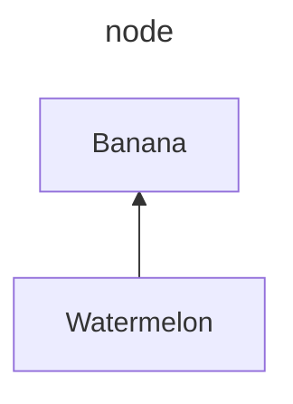

## 节点形状

默认是矩形，除此之外的形状展示在下方代码中

注意：
- 自定义形状的话需要写node的id
- id与后面的符号之间不能有空格
- id类似于别的语言中的id，是唯一的，不能给两个节点命名同一个id

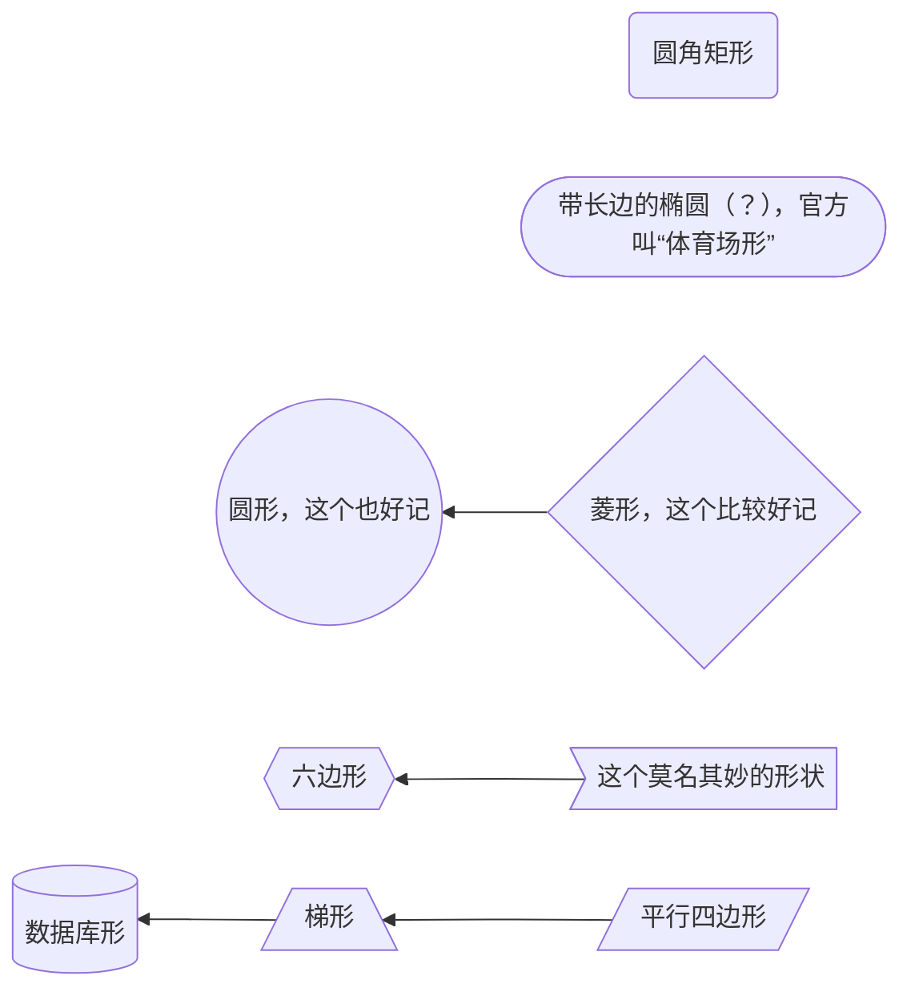

现在mermaid支持新的写法：`id@{ shape: 形状, label: "内容" }`

代码示例

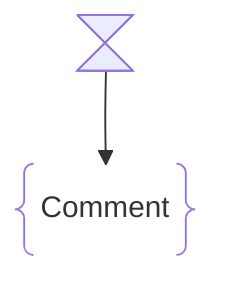

## Links between nodes

### 连线类型

见下方代码示例：

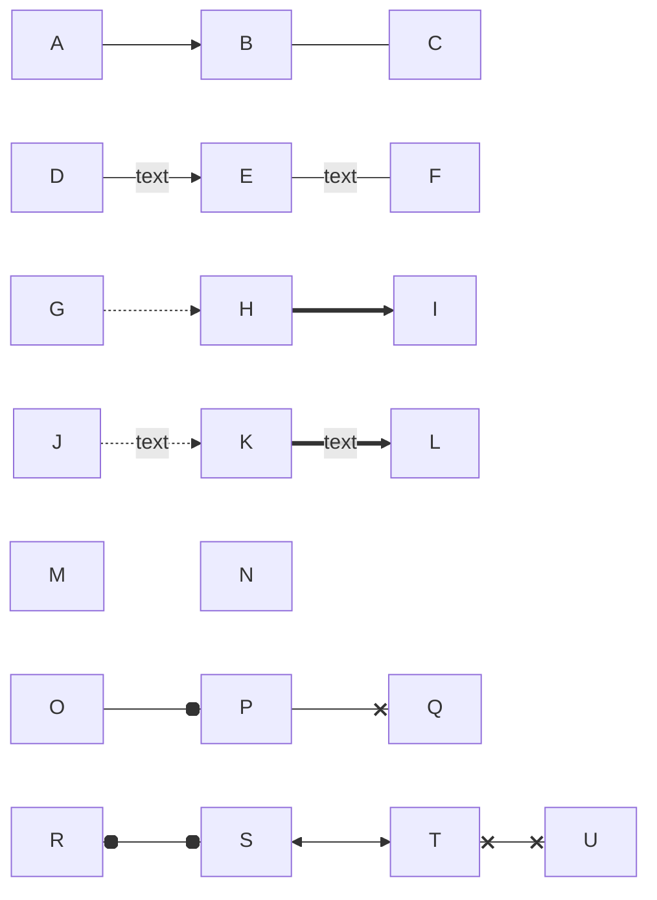

### "Network"

可以实现复杂的连线效果
- `-` 越多，连线越长
- 具体见下方代码示例：

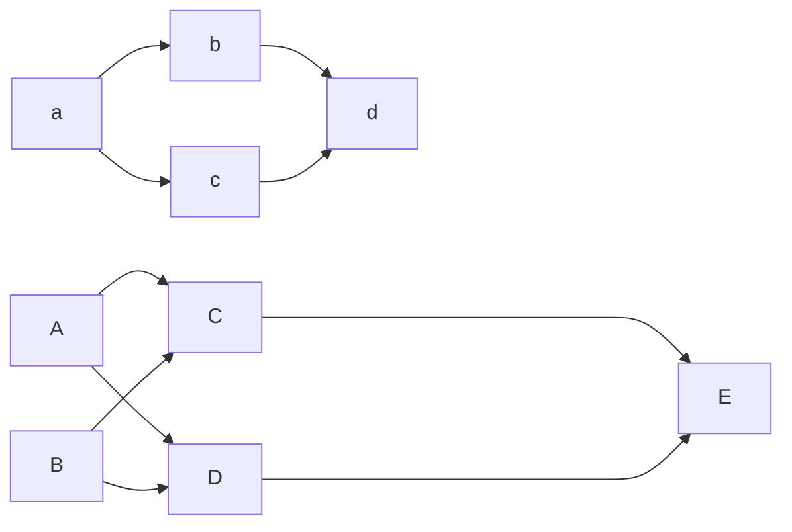

另一复杂示例：

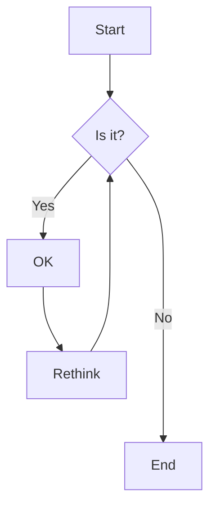

### 连线id

还可以给连线加id，通过@实现

- 结合前面的（借助@实现节点样式），这似乎是mermaid的一个语法格式： `id@{ 键值对 }`
- 可以借此实现动画（这有啥用？）

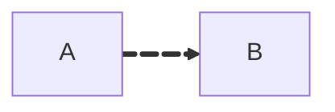

### 转义

*Special characters that break syntax*

使用 `"text"` 双引号来确保内容一定被识别成文字，而不是特殊字符

## 子图（subgraphs）

### 基本语法

```
subgraph title
    graph definition (contents)
end
```

示例如下：

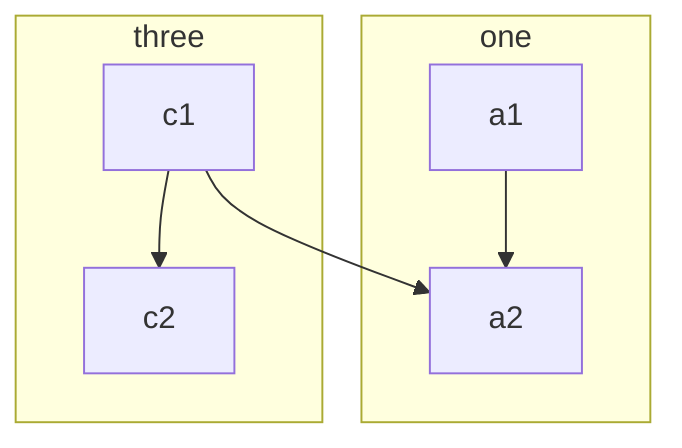

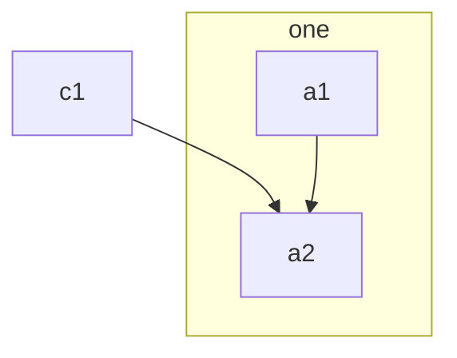

### 子图间连线

子图间也可以连线
- 写在最后
- 示例如下：

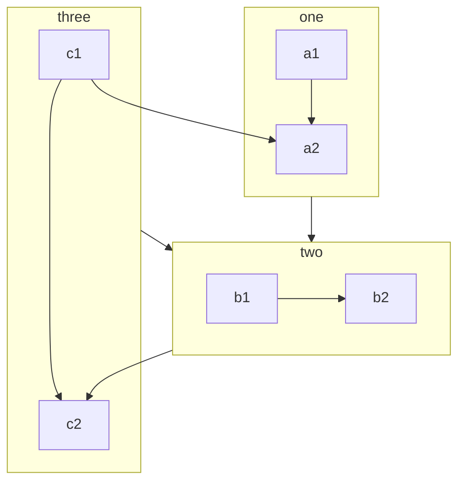

### 子图内方向

子图内可以定义与外面不同的方向
- 使用 `direction`
- 示例如下：

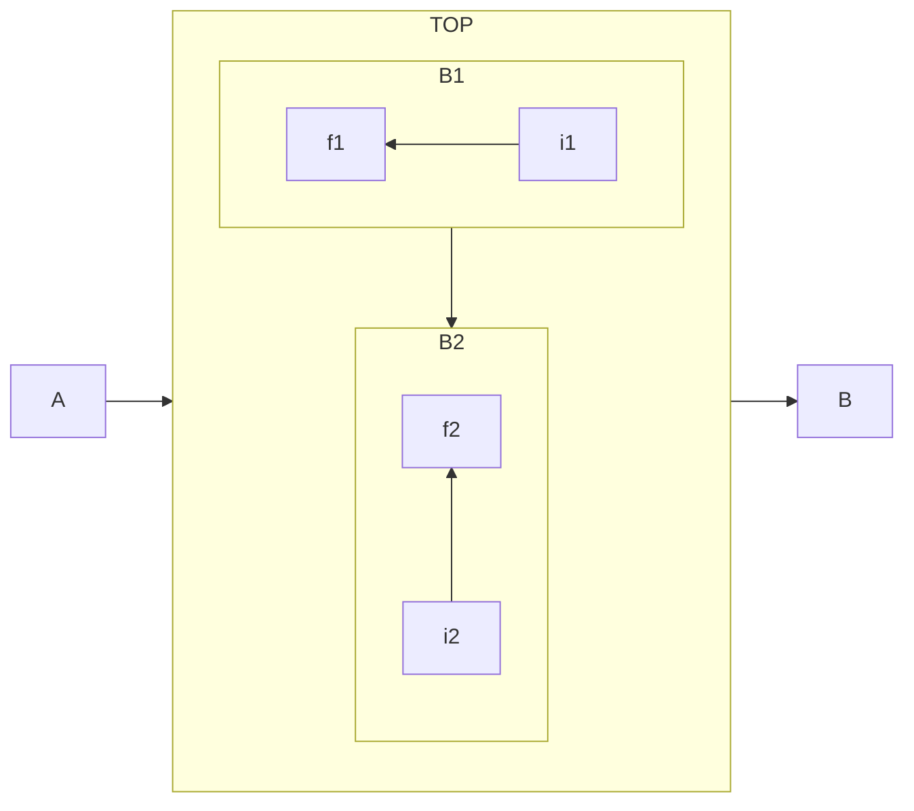
### 一个来自AI的语法建议

- 可以先写出所有的节点（`= 质料`），再在最下面写出节点之间的关系（`= 形式`）
- 示例代码如下

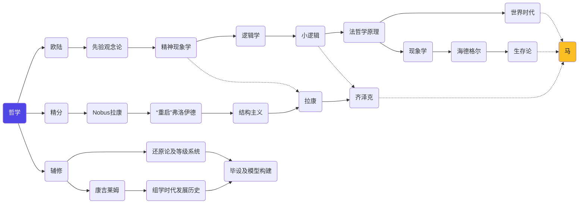

## Styling and classes

待补充，详见官网文档

## 其他

还有如下内容，此处略，详见官网文档：https://mermaid.js.org/syntax/flowchart.html
- 使用markdown（倒反天罡（bushi）
- Interaction（链接）