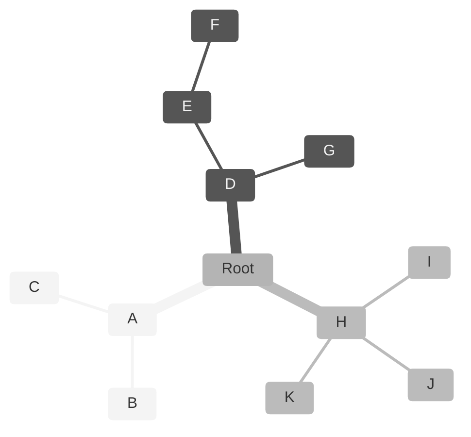
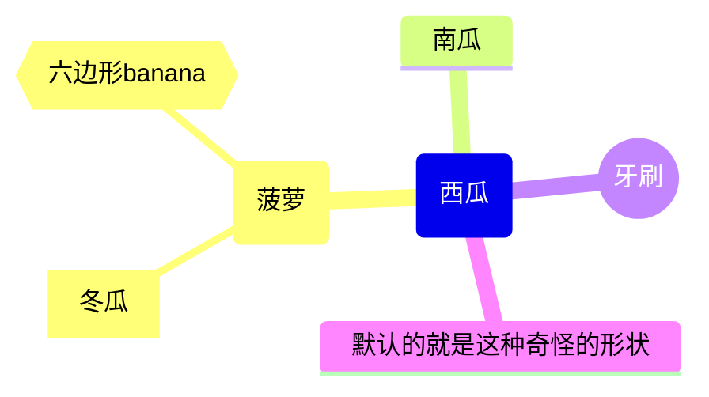
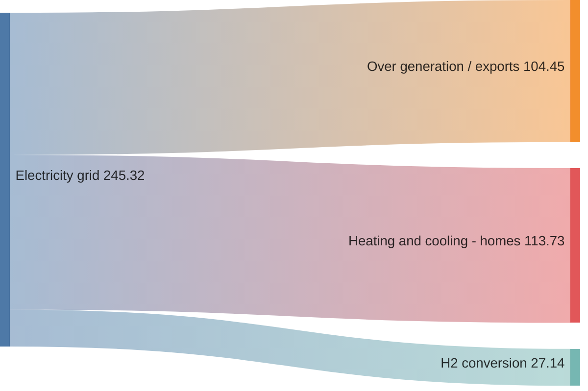

# Mermaid 5：其他图表

## 思维导图

思维导图（Mindmap）：思维导图是一种用于将信息可视化地组织成层级结构的图表，它展示了整体各个部分之间的关系。它通常围绕一个单一的概念创建，这个概念以图像的形式绘制在空白页的中心，然后添加与该概念相关的想法的表示

### 基本语法

创建思维导图的语法很简单：它依赖于缩进来设置层级结构中的级别

使用关键字 `mindmap` 来开始

- 紧跟在 mindmap 声明之后的第一个非空行，且该行没有或只有最少缩进的节点，会被自动识别为根节点
- 下面的字母可以直接替换为内容（见示例二）

### 个性化设置

#### 节点形状

可以使用不同的形状来显示节点

为节点指定形状时，**语法与流程图节点类似**

- 例如，`id(I am a rounded square)`

图标（icon）：此处略，详见官网文档：https://mermaid.js.org/syntax/mindmap.html

---

## 桑基图

Sankey diagram

